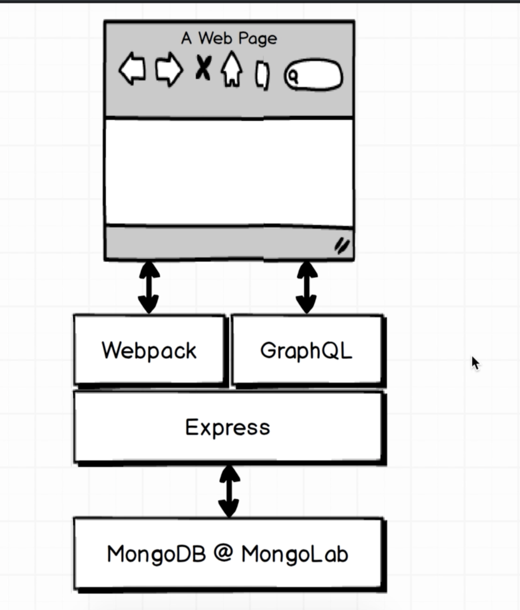

# Course notes

## RESTful - routing
Given a collection of records on a server, there should be a uniform URL and HTTP request method used to utilize that collection of records

## Shortcomings of RESTful Routing

* Nested entities means lots of HTTP requests for relational data
    - Often a solution is a very specific endpoint, meaning less DRY code that breaks RESTful conventions

* Often returns the whole model when we only need a subset of data for that model
    - I have seen summary and detail versions of models as a solution for RESTful APIs
    - This is also important for mobile data. Smaller responses.

The point of GraphQL is to solve these issues among some others.

## First application: Graphiql client with GraphQl

Client ---> Express/GraphQL Server ---> Datastore

## Large Companies

Large companies often don't have a large monolithic data store. There are usually a collection of systems responsible for certain pieces of data.
                       Client
                          +
                          |
                          | GraphQL Query
                          |
                          |
                          v
     +------------->Express/GraphQL Server<--------+
     |                    ^                        |
     |                    |                        |
     |                    |                        |
     |                    |                        | Http Request
     |                    |                        |
     |                    |                        |
     v                    v                        v
Outside Server #1      Outside API             Outside Server #2
     ^                                              ^
     |                                              |
     |                                              |
     |                                              |
     v                                              v
   Datastore                                   Datastore

The express server will receive the query. It will then make an HTTP request to some other API and fetch the data. Then it will assemble a GraphQL response and ship it back to the client. Simple.

## GraphQL

* Not changing how the data is stored

* Edges = relationships

* Schema files are the absolute linchpin of every GraphQL app. We have to inform GraphQL how are data is arranged. This is done with schema files.
    - This is also probably the bulk of the work you'll do when working with GraphQL.

* Root queries allow us to jump into our graph of data. Starting point. Takes the query and enters into the graph of data.

* resolve function is where we actually find the data we are looking for.
    - nearly all data fetching we do is async
    - In order to be async, resolve should return a promise. If a promise is returned, GraphQL automatically detects this and waits for the promise to resolve. This is very cool.
    - axios has a quirk when integrated with GraphQL. It nests data in a "data" property. GraphQL doesn't know that.

* Query Fragments
    - used to avoid duplication and copy/paste. Essentially a list of different properties that can be reused when querying and entity. Fragments are primarily used on the front end.

    ```javascript
        {
            apple: company(id: "1"){
                ...companyDetails,
            }
            google: company(id: "2"){
                ...companyDetails,
            }
        }
        fragment companyDetails on Company {
            id
            name
            description
        }
    ```
    the "on Company" bit ensures type checking.

* Mutations
    - somewhat challenging in GraphQL

## json-server

json-server automatically sets up relations behind the scenes.

## Second Application: React with GraphQl
React Client ---> GraphQL Client ---> Express/GraphQL Server ---> Datastore

### GraphQL Client

A GraphQL Client is a glue layer between a React Client and Express/GraphQL Server. Its purpose is to communicate/interface with the Express/GraphQL Server and forward it on to the (in this case) React client. You could build your client using another framework like Vue or Angular though.

GraphQL Client & Express/GraphQL Server are very loosely coupled as the protocol that links them is framework agnostic

Three big clients in use are Lokka, Apollo and Relay. These are browser, not backend technologies. We will be using Apollo for this project.

Side note: V1 Relay is amazingly performant for mobile users with an unstable data connection. But it's very complex. Probably overkill for most applications.

### Apollo

Apollo has a good balance of features and complexity.

However, on the backend, we are continuing to use express-graphq server instead of the apollo server. This is because the apollo server is still in active development and express-graphql is much less likely to get API changes in the future. express-graphql is the official implementation that Facebook maintains. It is the spec for how a server can be integrated with a server.

express-graphql also ensures you co-locate your types and resolvers. Apollo insists you separate those.

It's worth noting that apollo is not a bad tool and it is valid to use it.

### Overall Strategy

1. Identify data required
2. Write query in Graphiql(for practice) and in component file
3. Bond query + component
4. Access data!

### App Architecture


### Client-side Architecture
- GraphQL Server - hosting the data.
- Apollo Store - point of contact with GraphQL server. Makes sure the data we fetch is distributed throughout the app.
- Apollo Provider - integration point between react app and Apollo Store
- Song List - in GraphQL/Apollo apps, we tend to pick centralized components to receiving queries or data from the GraphQL server. Then we pass data from them down to child components.


### Optimistic Updates


For mutations, look at the response and then create your optimisticResponse based on it. It should be exact.

What happens if we guess what the response will be incorrectly? The eventual response from the backend will be the source of truth and will update Apollo store accordingly. Perhaps there will be some strange UX, but ultimately it will resolve itself correctly.

## Third Application: Building from scratch
### Authentication

- Passport JS - defacto authentication library for Node but not built with GraphQL in mind

There is a lot of logic in the AuthService that glues passport together with graphql. They don't interface well.

This section is a good example of how to ensure business logic is delegated to a service or function. You want to avoid place your logic in resolve functions.

### Setting up Apollo

Remember, the ApolloClient is just the piece of technology that interfaces with our backend; it has no idea how to interface with out React application. That is the job of the Apollo Provider - a glue layer between the Apollo Client that fetches all the data and our React client that displays all the data.

Network Interface - must configure the Apollo Client to attach auth cookie to request. In practice, this is simple boilerplate code added to the config object that is passed to the ApolloClient instance. 

## My app

- Building with multiple data sources
    - for this project I want to wrap two or more publicly available APIs with GraphQL
    - I won't be creating these APIs and therefore they must be decently documented
    - seems like if I want to use multiple data sources, I need multiple resolvers.